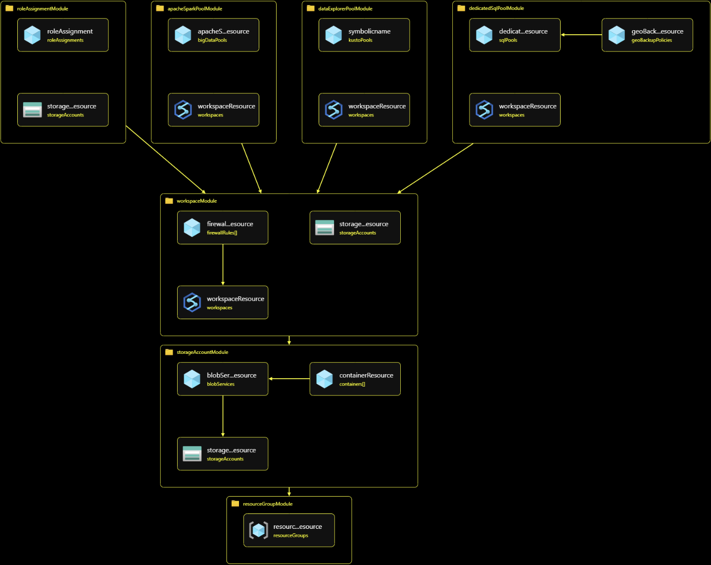

# Small Cost Synapse
Small Capacity Synapse (SCS) is an [Azure Synapse Analytics](https://learn.microsoft.com/en-us/azure/synapse-analytics/) sandbox environment that offers a ready-to-go small Synapse environment. Costs depends on the actual usage of storage and compute capacity. SCS is not intended for production purposes. 

## 1 Building blocks 
SCS consists of mandatory Azure resources and optional Azure resources (mainly the pools) which will be explained below. 

### 1.1 Required resources
#### 1.1.1 Resource groups 
The following resource groups are created. The default region is West Europe. 
|Resource | Description
|--|--|
| `rg-scs-sbx-we-1` | Contains workspace and data lake.
| `rg-scs-man-sbx-we-1` | Contains the SQL server, Serverless SQL Pool, and optionally the Dedicated SQL Pool. Enable the  `show hidden types` in the resource group page if you don't see any resources in the Azure Portal. 

#### 1.1.2 Data lake  
|Resource | Description
|--|--|
|`sascssbxwe1` |An storage account version 2 with a hierarchical namespace is created (access tier hot; SKU Standard_LRS).

#### 1.1.3 Synapse workspace
|Resource | Description
|--|--|
|`synws-scs-sbx-we-1` |The Synapse workspace includes the serverless SQL Pool with the same name.

### 1.2 Optional Resources 
#### 1.2.1 Dedicated SQL Pool
|Resource | Description
|--|--|
|`syndpscssbxwe1` | Dedicated SQL Pool with SKU `DW100c`. Reduce costs by suspending the dedicated SQL Pool.

#### 1.2.2 Apache Spark Pool
|Resource | Description
|--|--|
|`synsp-scs-sbx-we-1` |An Apache Spark Pool with three _small_ nodes and Spark version 3.2.

#### 1.2.3 Data Explorer Pool 
|Resource | Description
|--|--|
`synde-scs-sbx-we-1` |An `Extra small` Data explorer Pool. Only the pool is created, there is no database created.

## 2 Deployment
[Bicep](https://learn.microsoft.com/en-us/azure/azure-resource-manager/bicep/overview?tabs=bicep) scripts are used to deploy the resources. 
### 2.1 Parameters 
Most parameters are provided with default values. By default, only the Serverless SQL Pool is created. The other pools can be created by setting the applicable parameter values to `true` in the `createResources.parameters.json` file:
- `createDedicatedSQLPool`
- `createApacheSparkPool`
- `createDataExplorerPool`

### 2.2 Invoking Bicep Script
Several `bash` scripts are included for (re)deployment or removal of the resources in Azure Command-Line (Azure CLI). 
| Script | Description
|--|--
az-0-set-config.sh | Sets the default location and default resource group
az-1-create-resources.sh | Calls the `createResources.bicep` main script.   
az-9-delete-resource-group.sh| Deletes both resource groups including contents, will ask for confirmation.
Enable the execute file attribute on the `bash` files if necessary.

The deployment logs can be found on the subscription level.

⚠️ Assign the role `Storage Blob Data Contributor` to *any* Synapse user to prevent errors related to HTTP 403 status code when accessing the storage account from within the pools. 

### 2.3 Overview Bicep Modules
